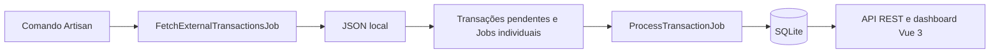

<div align="center">
  <h1>Univille Bank</h1>
  <p><strong>Painel de conciliação financeira com Laravel e Vue 3</strong></p>
  <p>Ingestão simulada de transações, processamento assíncrono em filas e dashboard autenticado para consulta e acompanhamento.</p>
  <p>


  </p>
</div>

## Tecnologias

| Camada          | Stack                                                                                                                                                                                                                                                                                                                                                                                                                                                                                                                                                |
| :-------------- | :--------------------------------------------------------------------------------------------------------------------------------------------------------------------------------------------------------------------------------------------------------------------------------------------------------------------------------------------------------------------------------------------------------------------------------------------------------------------------------------------------------------------------------------------------- |
| **Backend**     |                                                                                                                           |
| **Frontend**    |      |
| **Ferramentas** |                              |

O frontend utiliza **Composition API com `<script setup>`**. Os testes utilizam **PHPUnit** (backend) e **`node:test`** (frontend).

## Como funciona



A fonte JSON simula uma API externa, como permitido no teste. Cada transação é processada por um Job independente, com validação, **retry**, registro de falhas e idempotência. Valores monetários são armazenados como **inteiros em centavos**, sem `float`.

O backend separa **domínio**, **casos de uso** e **infraestrutura**, com responsabilidades de HTTP e Jobs isoladas. No frontend, views, componentes, estado e comunicação HTTP são organizados separadamente.

## Instalação

### Pré-requisitos

- **Git**, **Docker** com Compose e **Node.js** (20.19+ na linha 20 ou 22.12+) com npm.
- Terminal **Bash** (Linux, macOS ou WSL2 no Windows). No WSL2, habilite a integração com o Docker Desktop.
- Portas **8000** (API) e **5173** (frontend) disponíveis.

### 1. Clonar o projeto

```bash
git clone https://github.com/arturcarletto/univille-bank.git
cd univille-bank
```

### 2. Preparar o backend e o banco

Na raiz do projeto:

```bash
docker compose build app worker
docker compose run --rm --no-deps app composer install --no-interaction --prefer-dist

if [ ! -f backend/.env ]; then
  cp backend/.env.example backend/.env
  docker compose run --rm --no-deps app php artisan key:generate
fi
touch backend/database/database.sqlite
docker compose run --rm --no-deps app php artisan migrate --force
```

A configuração usa **SQLite** e **Database Queues**:

```dotenv
DB_CONNECTION=sqlite
QUEUE_CONNECTION=database
```

O Compose aponta `DB_DATABASE` para `/workspace/backend/database/database.sqlite`. API e worker compartilham esse banco e a fila. **Não regenere a `APP_KEY` nem substitua o banco de uma instalação existente.**

### 3. Iniciar API e worker

```bash
docker compose up -d app worker
```

API: **http://localhost:8000**

### 4. Iniciar o frontend

Em outro terminal, na raiz do projeto:

```bash
[ -f frontend/.env ] || cp frontend/.env.example frontend/.env
cd frontend
npm ci
npm run dev
```

Dashboard: **http://localhost:5173**

O Vite encaminha `/api` ao Laravel pelo proxy definido no frontend.

## Demonstração

Acesse **http://localhost:5173**, cadastre um usuário e faça login. Os comandos
abaixo usam Bash, na raiz do projeto, com API e frontend ativos. Defina este
atalho uma vez no mesmo terminal:

```bash
ingest() {
  docker compose run --rm --no-deps app php artisan transactions:ingest "$1"
}
```

Execute os cenários **1 → 5 no mesmo banco SQLite**, aguardando os Jobs entre
as etapas. As contagens referem-se a cada lote na primeira ingestão; dados
anteriores são preservados. Os cenários 1 e 2 adicionam **53 processadas** quando
os IDs ainda não existem. Reingestões não somam registros nem recriam pendentes.

### 1. Demonstração rápida

```bash
ingest transactions.json
```

**Esperado:** 3 processadas, 0 pendentes, 0 inválidas e nenhuma falha de ingestão.
O comando apenas enfileira a busca; aguarde o worker. A lista inicia em
`processed` e os indicadores mostram os totais globais.

### 2. Processamento assíncrono / Short Polling

<details>
<summary><strong>Observar pendentes antes de iniciar o processamento</strong></summary>

Aguarde o cenário 1 e quaisquer Jobs anteriores concluírem. Com a fila sem Jobs
anteriores, pare o worker e faça a **primeira ingestão** da fixture demo. Seus IDs
precisam estar ausentes para observar a transição. Se já existem, a reexecução é
idempotente e não recria pendentes; prossiga para consultar os estados existentes,
sem apagar registros nem recriar o banco.

```bash
docker compose stop worker
ingest transactions-demo.json
docker compose run --rm --no-deps app php artisan queue:work database --once --sleep=1 --tries=3 --timeout=90
```

Na primeira ingestão, `--once` executa somente o Job de busca: **50 pendentes**,
0 processadas, 0 inválidas e nenhuma falha de ingestão para esse lote. Antes desse Job, há uma
busca enfileirada e as transações ainda não aparecem. Aplique o filtro `pending`
para vê-las; mantenha a aba visível e reinicie o worker:

```bash
docker compose up -d worker
```

**Esperado na primeira ingestão:** as pendentes deste lote chegam a 0 e as
processadas aumentam em 50 automaticamente. Seus registros desaparecem da lista
em `pending`; aplique `processed` para ver o resultado.

</details>

O **Short Polling** agenda cada atualização **5 segundos após a conclusão da
anterior**. Pausa com a aba oculta e retoma ao voltar, preservando filtros
aplicados, página e campos em edição. Falhas transitórias de consulta mantêm os
últimos dados e permitem nova tentativa; o botão **Atualizar dados** está disponível.

### 3. Demonstração completa

Use o lote já processado no cenário 2, **sem ingerir novamente a fixture**.

A nova fixture contém **50 transações fictícias**, com IDs `TX-DEMO-001` a
`TX-DEMO-050`, valores de **R$ 6,50 a R$ 15.750,90** e ocorrências entre
01 e 05/10/2026, com fuso explícito. Não contém dados pessoais.

**Esperado:** 50 processadas, 0 pendentes, 0 inválidas e nenhuma falha de ingestão.
Exercite status, faixa de valores e paginação. Somente o lote demo ocupa
**4 páginas** de 15 registros (15 + 15 + 15 + 5). Com os 3 registros do cenário 1,
a lista tem **53 registros em 4 páginas** (15 + 15 + 15 + 8); outros dados
anteriores alteram o total.
Para o filtro de período, use o **dia de recebimento em UTC**, consultável na tabela.

### 4. Idempotência

Após concluir os cenários 2 e 3, execute novamente `ingest transactions-demo.json`
e aguarde o worker concluir o Job de busca.

**Esperado:** uma nova execução de ingestão é registrada, mas nenhuma transação
ou Job individual é duplicado. As 50 transações permanecem processadas, sem novas
pendentes, inválidas ou falhas de ingestão. Os indicadores globais não aumentam.

### 5. Tratamento de falhas

Com o worker ativo, use `ingest <arquivo>`, substituindo o nome pelos exemplos:

| Arquivo em `backend/database/fixtures/` | Processadas | Pendentes ao final | Inválidas | Falha de ingestão |
| :------------------------------------ | ----------: | -----------------: | --------: | :--------------- |
| `transactions-with-invalid.json` | 1 | 0 | 1 | Nenhuma: o item inválido termina em `invalid`, sem retry nem Job falho. |
| `corrupt.json` | 0 | 0 | 0 | JSON ilegível: após até 3 tentativas, execução em `failed` e Job em `failed_jobs`. |
| `missing.json` (inexistente) | 0 | 0 | 0 | Fonte indisponível: após até 3 tentativas, execução em `failed` e Job em `failed_jobs`. |

Execute as três fontes em sequência, aguardando os Jobs de cada fonte terminarem
antes da próxima. Contagens por fixture na primeira ingestão: o lote misto acrescenta
1 processada e 1 inválida (54 processadas e 1 inválida no roteiro sem outros
dados); as fontes corrompida e ausente não alteram esses totais. Repetir o lote
misto não duplica seus itens; repetir uma fonte ilegível gera outra execução
de ingestão falha. O lote misto mantém o item válido independente do inválido; aplique o filtro `invalid` para consultar este último.
Os indicadores contam apenas `pending` e `processed`, não inválidas nem falhas.

Falhas de **fonte** não criam transações: ficam em `ingestion_runs` e
`failed_jobs`. Já uma falha definitiva de **processamento individual** marca a
transação como `failed`; esse estado não é provocado pelas fixtures acima.
O código aplica backoff de **5 e 30 segundos entre as três tentativas** de busca;
aguarde o worker concluir antes de conferir:

```bash
docker compose run --rm --no-deps app php artisan queue:failed
docker compose logs --tail=50 worker
```

## API REST

| Método | Rota                     | Função                      | Autenticação |
| :----- | :----------------------- | :-------------------------- | :----------- |
| `POST` | `/api/register`          | Cadastro                    | Pública      |
| `POST` | `/api/login`             | Login e token               | Pública      |
| `POST` | `/api/logout`            | Revogar token               | Bearer       |
| `GET`  | `/api/transactions`      | Listar e filtrar transações | Bearer       |
| `GET`  | `/api/dashboard/summary` | Indicadores globais         | Bearer       |

O Laravel Sanctum protege as rotas autenticadas com `Authorization: Bearer <token>`.

**Filtros de `/api/transactions`:** `status` (`pending`, `processed`, `invalid`, `failed`), `from` e `to` (datas `YYYY-MM-DD` aplicadas a **`received_at` em UTC**, dias inclusivos), `min_amount`, `max_amount`, `page` e `per_page` (padrão 15, máximo 100).

O período representa o recebimento pelo sistema, não a ocorrência (`occurred_at`) da transação.

A API usa **Form Requests**, **API Resources** e filtros/paginação diretamente no SQL.

## Testes

**Backend** — na raiz:

```bash
docker compose run --rm --no-deps app php artisan test --env=testing --do-not-cache-result
docker compose run --rm --no-deps app php vendor/bin/pint --test
```

**Frontend** — em `frontend/`:

```bash
npm test
npm run lint
npm run build
```

## Estrutura

```text
univille-bank/
├── backend/       # API Laravel, domínio, Jobs e migrations
├── frontend/      # Dashboard Vue 3
├── docs/          # Evidências e documentação técnica
├── compose.yaml   # Serviços de API e worker
├── Dockerfile     # Imagem PHP
└── README.md
```
