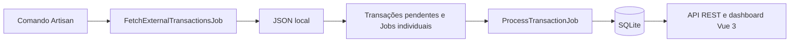

<div align="center">
  <h1>Univille Bank</h1>
  <p><strong>Painel de conciliação financeira com Laravel e Vue 3</strong></p>
  <p>Ingestão simulada de transações, processamento assíncrono em filas e dashboard autenticado para consulta e acompanhamento.</p>
  <p>


  </p>
</div>

## Tecnologias

| Camada          | Stack                                                                                                                                                                                                                                                                                                                                                                                                                                                                                                                                                |
| :-------------- | :--------------------------------------------------------------------------------------------------------------------------------------------------------------------------------------------------------------------------------------------------------------------------------------------------------------------------------------------------------------------------------------------------------------------------------------------------------------------------------------------------------------------------------------------------- |
| **Backend**     |                                                                                                                           |
| **Frontend**    |      |
| **Ferramentas** |                              |

O frontend utiliza **Composition API com `<script setup>`**. Os testes utilizam **PHPUnit** (backend) e **`node:test`** (frontend).

## Como funciona



A fonte JSON simula uma API externa, como permitido no teste. Cada transação é processada por um Job independente, com validação, **retry**, registro de falhas e idempotência. Valores monetários são armazenados como **inteiros em centavos**, sem `float`.

O backend separa **domínio**, **casos de uso** e **infraestrutura**, com responsabilidades de HTTP e Jobs isoladas. No frontend, views, componentes, estado e comunicação HTTP são organizados separadamente.

## Instalação

### Pré-requisitos

- **Git**, **Docker** com Compose e **Node.js** (20.19+ na linha 20 ou 22.12+) com npm.
- Terminal **Bash** (Linux, macOS ou WSL2 no Windows). No WSL2, habilite a integração com o Docker Desktop.
- Portas **8000** (API) e **5173** (frontend) disponíveis.

### 1. Clonar o projeto

```bash
git clone https://github.com/arturcarletto/univille-bank.git
cd univille-bank
```

### 2. Preparar o backend e o banco

Na raiz do projeto:

```bash
cp backend/.env.example backend/.env
touch backend/database/database.sqlite

docker compose build app worker
docker compose run --rm --no-deps app composer install --no-interaction --prefer-dist
docker compose run --rm --no-deps app php artisan key:generate
docker compose run --rm --no-deps app php artisan migrate --force
```

A configuração usa **SQLite** e **Database Queues**:

```dotenv
DB_CONNECTION=sqlite
QUEUE_CONNECTION=database
```

O Compose aponta `DB_DATABASE` para `/workspace/backend/database/database.sqlite`. API e worker compartilham esse banco e a fila. **Não regenere a `APP_KEY` nem substitua o banco de uma instalação existente.**

### 3. Iniciar API e worker

```bash
docker compose up -d app worker
```

API: **http://localhost:8000**

### 4. Iniciar o frontend

Em outro terminal, na raiz do projeto:

```bash
cp frontend/.env.example frontend/.env
cd frontend
npm ci
npm run dev
```

Dashboard: **http://localhost:5173**

O Vite encaminha `/api` ao Laravel pelo proxy definido no frontend.

## Demonstração

1. Acesse o dashboard, **cadastre um usuário** (nome, e-mail e senha) e faça login.
2. Na raiz do projeto, execute:

   ```bash
   docker compose run --rm --no-deps app php artisan transactions:ingest transactions.json
   ```

3. Aguarde o worker processar os Jobs: o dashboard atualiza indicadores e tabela automaticamente.

A fonte `backend/database/fixtures/transactions.json` contém **3 transações válidas**. Em um banco novo, o resultado esperado é **3 processadas e 0 pendentes**.

A interface disponibiliza **filtros por status, período e valores**, **paginação** e **indicadores globais** de transações pendentes e processadas.

O **Short Polling** consulta a API na abertura e agenda cada atualização 5 segundos
após a conclusão da anterior. Pausa com a aba oculta e retoma ao voltar, mantendo
filtros aplicados, página e campos em edição. O botão **Atualizar dados** continua
disponível; falhas transitórias preservam os últimos dados e permitem nova tentativa.

<details>
<summary><strong>Ver a transição de pendente para processada</strong></summary>

Em um banco novo, antes da primeira ingestão, interrompa o worker:

```bash
docker compose stop worker
docker compose run --rm --no-deps app php artisan transactions:ingest transactions.json
docker compose run --rm --no-deps app php artisan queue:work database --once --sleep=1 --tries=3 --timeout=90
```

O primeiro Job lê a fonte e cria **3 transações pendentes**. Filtre por `pending`;
o polling exibirá esses registros. Para processá-las, reinicie o worker:

```bash
docker compose up -d worker
```

Observe o indicador chegar a **3 processadas** automaticamente. Para listar esses
registros, mude o filtro de status para `processed`.

</details>

### Tratamento de erros

| Fixture em `backend/database/fixtures/` | Cenário                                  |
| :-------------------------------------- | :--------------------------------------- |
| `transactions-with-invalid.json`        | Transação com dados inválidos            |
| `corrupt.json`                          | JSON corrompido                          |
| `missing.json`                          | Fonte indisponível (arquivo inexistente) |

Para testar outra fixture, substitua o nome do arquivo no comando `transactions:ingest`. Consulte falhas definitivas com:

```bash
docker compose run --rm --no-deps app php artisan queue:failed
```

## API REST

| Método | Rota                     | Função                      | Autenticação |
| :----- | :----------------------- | :-------------------------- | :----------- |
| `POST` | `/api/register`          | Cadastro                    | Pública      |
| `POST` | `/api/login`             | Login e token               | Pública      |
| `POST` | `/api/logout`            | Revogar token               | Bearer       |
| `GET`  | `/api/transactions`      | Listar e filtrar transações | Bearer       |
| `GET`  | `/api/dashboard/summary` | Indicadores globais         | Bearer       |

O Laravel Sanctum protege as rotas autenticadas com `Authorization: Bearer <token>`.

**Filtros de `/api/transactions`:** `status` (`pending`, `processed`, `invalid`, `failed`), `from` e `to` (datas `YYYY-MM-DD`, UTC), `min_amount`, `max_amount`, `page` e `per_page` (padrão 15, máximo 100).

A API usa **Form Requests**, **API Resources** e filtros/paginação diretamente no SQL.

## Testes

**Backend** — na raiz:

```bash
docker compose run --rm --no-deps app php artisan test --env=testing --do-not-cache-result
docker compose run --rm --no-deps app php vendor/bin/pint --test
```

**Frontend** — em `frontend/`:

```bash
npm test
npm run lint
npm run build
```

## Estrutura

```text
univille-bank/
├── backend/       # API Laravel, domínio, Jobs e migrations
├── frontend/      # Dashboard Vue 3
├── docs/          # Evidências e documentação técnica
├── compose.yaml   # Serviços de API e worker
├── Dockerfile     # Imagem PHP
└── README.md
```
